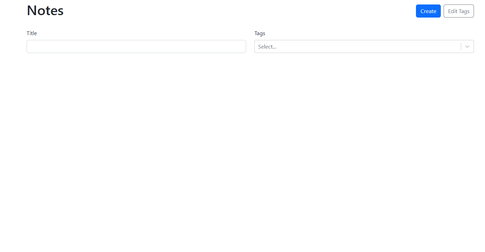

# Don't Forget
Use this TO-DO app to keep track of your daily task!  

**Link to project:**https://notes-beta-hazel.vercel.app/  

 

## How It's Made:

**Tech used:** HTML, CSS, JavaScript, React, and TypeScript.

In this project I made a simple notes app that allows people to create and illustate tasks they need to complete.
## Optimizations

I added some simple colors to make the application more user friendly. I made this app from TypeScript to just illustrate my skills in the language. I also tried to use as much simple and clean code as possible to make sure the application works as smooth as possible.
## Lessons Learned:

For this application I learned how to to effectivly use TypScript and its components to make a simple app with React.

## Examples:
Take a look at these couple examples that I have in my own portfolio:

**Grub:**https://github.com/DominikJ22/grub

**Holiday Tick List:** https://github.com/DominikJ22/holiday

**Ticket Tracker:** https://github.com/DominikJ22/ticket-tracker
